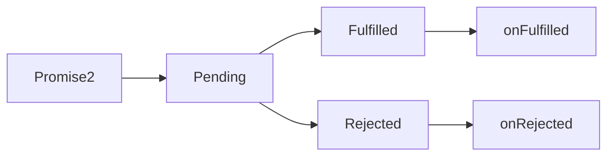

## 1. 同步模式、异步模式、回调函数

### JavaScript 单线程
* JavaScript设计初衷，运行在浏览器端的脚本语言，DOM操作实现交互
* 不使用单线程，会造成严重的线程同步问题
* 例如：一个线程删除，一个线程修改


### JavaScript 同步模式 【Synchronous】
* 代码逐行运行
* 会出现阻塞【某行代码运行时间过长，后面代码会一直等待】


### JavaScript 异步模式 【Asynchromous】
* 需要进行异步执行的代码，开启之后就会继续执行主线程代码，不会进行等待
* 后序逻辑，一般会通过回调函数的方式定义
* JavaScript 是单线程的，浏览器不是单线程的
* 类似于 setTimeout 之类的api，是有一个单独的线程去执行，等待的


### <font color="red">回调函数</font>
> 所有异步编程方案的根基
* https://www.jianshu.com/p/40e459cfdc6f
* 将函数作为参数
* 我知道执行的相关代码，但我不知道何时能得到结果【开始调用】
* 所以，将步骤写好【回调函数】，交给函数运行者，运行完后会帮我调用回调函数的内容
```javascript
function foo(callback) {
    setTimeout(function() {
        callback()
    }, 3000)
}

foo(function() {
    console.log('这就是一个回调函数')
    console.log('调用者定义这个函数，执行者执行这个函数')
    console.log('其实就是调用者告诉执行者异步任务结束后应该做什么')
})
```


## 2. 回调函数 Promise
### 异步模式
 * 运行环境提供的API是以同步或异步模式的方式工作
 
[](https://imgtu.com/i/6B6OYQ)

#### 回调函数
定义：由调用者定义，交给执行者执行的函数
> 所有异步编程方案的根基
* https://www.jianshu.com/p/40e459cfdc6f
* 将函数作为参数
* 我知道执行的相关代码，但我不知道何时能得到结果【开始调用】
* 所以，将步骤写好【回调函数】，交给函数运行者，运行完后会帮我调用回调函数的内容


#### Promise
* 在ES2015中被标准化，成为语言规范



#### Promise的基本用法

```js
const promise = new Promise(function(resolve, reject) {
  // 这里用于"兑现"承诺
  resolve(100) // 承诺达成

  reject(new Error('promise rejected')) // 承诺失败

  // 两者只能调用其一

})

promise.then(function(value) {
  console.log('resolved', value)
}, function(error) {
  console.log('rejected', error)
})
console.log('end')

```
##### Promise 方式的 ajax

```javascript
function ajax(url) {
  return new Promise(function(resolve, reject) {
    
    var xhr = new XMLHttpRequest()
    xhr.open('GET', url)
    xhr.responseType = 'json'
    xhr.onload = function() {
      if (this.status == 200) {
        resolve(this.response)
      } else {
        reject(new Error(this.statusText))
      }
    }
    xhr.send()
  })
}

ajax('/api/users.json').then(function(res) {
  console.log(res)
}, function(error) {
  console.log(error)
})
```
##### 使用Promise的链式调用尽可能保证异步任务扁平化
* Promise对象的then方法会返回一个全新的Promise对象
* 后面的then方法就是在为上一个then返回的Promise注册回调
* 前面then方法中回调函数的返回值会作为后面then方法回调的参数
* 如果回调中返回的是Promise, 好后面then方法的回调会等待它的结束
##### Promise的异常处理

```js
ajax('/api/users.json')
    .then()
    .catch()
    
// .catch() == .then(undefine, () => {
    // catch后听处理
})
```
> 全局能监听 unhandledrejection
* 不建议在全局监听

```js
// 浏览器中
window.addEventListener('unhandledrejection', event => {
    const { reason, promise } = event
    console.log(reason, promise)
    // reason => Promise 失败原因，一般是一个错误对象
    // promise => 出现异常的 Promise 对象
    
    event.preventDefault()
}, false)

// 浏览器中
process.on('unhandledrejection', (reason, promise) => {
    console.log(reason, promise)
    // reason => Promise 失败原因，一般是一个错误对象
    // promise => 出现异常的 Promise 对象
})
```

##### Promise的静态方法
* Promise.resolve()

```js
Promise.resolve('foo')
    .then(function(value) {
        console.log(value)
    })
    
// 等价于
new Promise(function(resolve, reject) {
    resolve('foo')
})


var promise = ajax('/api/users.json')
var promise2 = Promise.resolve(promise)
console.log(promise === promise2) // true


Promise.resolve({
  then: function (onFulfilled, onRejected) {
    onFulfilled('foo')
  }
})

```
* Promise.reject()

```js
Promise.reject('anything')
  .catch(function(error) {
    console.log(error)
  })
```
##### Promise 并行执行
* Promise.all 等待所有任务结束

```js
var promise = Promise.all([
  ajax('/api/users.json'),
  ajax('/api/posts.json')
])

promise.then(function(values) {
  console.log(values)
}).catch(function(error) {
  console.log(error)
})
```
* Promise.race 只会等待第一个结束的任务

```js
const request = ajax('/api/posts.json')
const timeout = new Promise((resolve, reject) => {
  setTimeout(() => reject(new Error('timeout')), 500)
})

Promise.race([
  request,
  timeout
])
  .then(value => {
    console.log(value)
  })
  .catch(error => {
    console.log(error)
  })
```

## 3.1 异步方案 Generator

* ES2015提供的 Generator
#### 生成器函数回顾

```js
// 生成器函数回顾
function *foo() {
  console.log('start')

  try {
    const res = yield 'foo'
    console.log(res) // bar
  } catch(e) {
    console.log(e)
  }
}

const generator = foo()

const result = generator.next()
console.log(result)

generator.next('bar')

generator.throw(new Error('Generator error')) // 就需要 foo当中try catch

```
### 体验Generator函数异步方案
```js
function *main() {
  const users = yield ajax('/api/users.json')
  console.log(users)

  const posts = yield ajax('/api/posts.json')
  console.log(posts)
}

const g = main()
const result = g.next()
result.value.then(data => {
  const result2 = g.next(data) // 在这里传入 上面 main中的users才会有值
  if (result2.done) return

  result2.value.then(data => {
    g.next(data)

  })
})
```
### 递归执行Generator函数
```js

function *main() {
  const users = yield ajax('/api/users.json')
  console.log(users)

  const posts = yield ajax('/api/posts.json')
  console.log(posts)
}
const g = main()

co(main)

function co(generator) {
  const g = generator()

  function handleResult(result) {
    if (result.done) return // 生成器函数结束
    result.value.then(data => {
      handleResult(g.next(data))
    }).catch(error => {
      g.throw(error)
    })
  }
  handleResult(g.next())
}
```

## 3.2 异步方案 Async

### Anync / Await 语法糖
> 语言层面的异步编程标准

```js
async function main() {
  try {
    const users = await ajax('/api/users.json')
    console.log(users)

    const posts = await ajax('/api/posts.json')
    console.log(posts)
  } catch(e) {
    console.log(e)
  }
}

const promise = main()
promise.then(() => {
  console.log('all completed')
})
```
